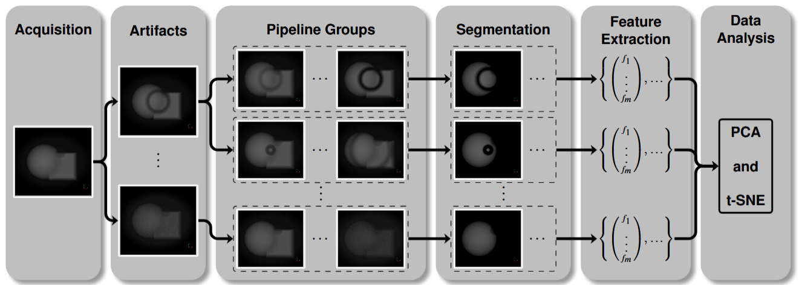

# Surface-aware Mesh Texture Synthesis with Pre-trained 2D CNNs
[Jakob Peischl](mailto:e12123459@student.tuwien.ac.at), [Renata G. Raidou](https://www.cg.tuwien.ac.at/staff/RenataRaidou)




This repository contains the official implementation of the paper "nvestigating the Propagation of CT Acquisition Artifacts
along the Medical Imaging Pipeline".

Abstract: *We propose a framework to support the simulation, exploration, and analysis of uncertainty propagation in
the medical imaging pipeline—exemplified with artifacts arising during CT acquisition. Uncertainty in the
acquired data can affect multiple subsequent stages of the medical imaging pipeline, as artifacts propagate
and accumulate along the latter, influencing the diagnostic power of CT and potentially introducing biases in
eventual decision-making processes. We designed and developed an interactive visual analytics framework that
simulates real-world CT artifacts using mathematical models, and empowers users to manipulate parameters
and observe their effects on segmentation outcomes. By extracting radiomics features from artifact-affected
segmented images and analyzing them using dimensionality reduction, we uncover distinct patterns related to
individual artifacts or combinations thereof. We demonstrate our proposed framework on use cases simulating
the effects of individual and combined artifacts on segmentation outcomes. Our application supports the
effective and flexible exploration and analysis of the impact of uncertainties on the outcomes of the medical
imaging pipeline. Initial insights into the nature and patterns of the simulated artifacts could also be derived.*

## Running the code

The project uses two languages that interact with each other. Most of the application is written in C++ while data
processing is done using Python. For running the code, you need
 - C++ Compiler with full C++20 support
 - C++ Dependencies
   - Some of the required dependencies get installed automatically by CMake when running the application for the first time. Unfortunately, dependency management through CMake can be fragile. So some things might not work immediately on some systems. The dependencies and their setup are implicitly documented in the respective CMakeList.txt in the /deps directory of this project.
   - Qt 6.6.2
   - VTK 9.3.0 with Qt Support
   - HDF5: This dependency needs to be installed manually. Please ensure that zlib support is enabled.
 - Python 3.9
 - Python Dependencies:
   - PyRadiomics 3.1.0: Either install the official version using `pip install 'pyradiomics==3.1.0'` or install the custom performance-optimized version in the `/external` directory of this project. For more information, please read the `README.md` file there.

These are the dependencies the system was last tested with. Newer minor releases will probably also work.

## BibTeX
Paper:
```
TBD
```

Code:
```
TBD
```